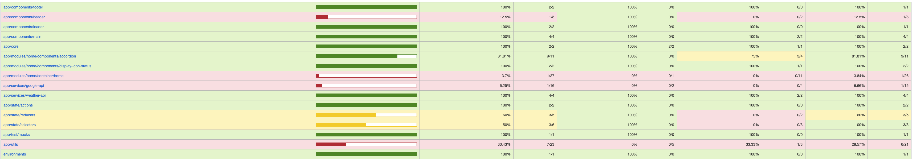
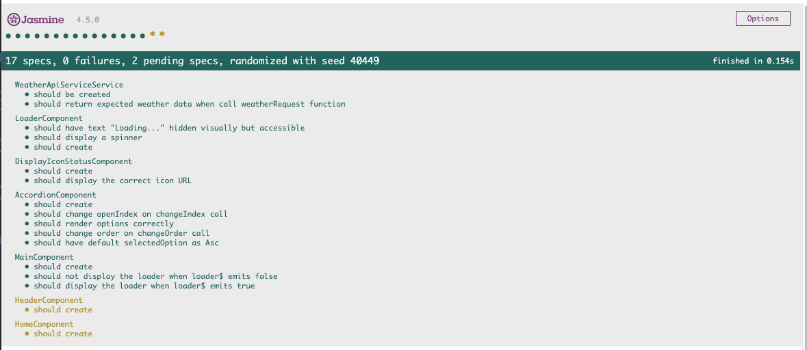
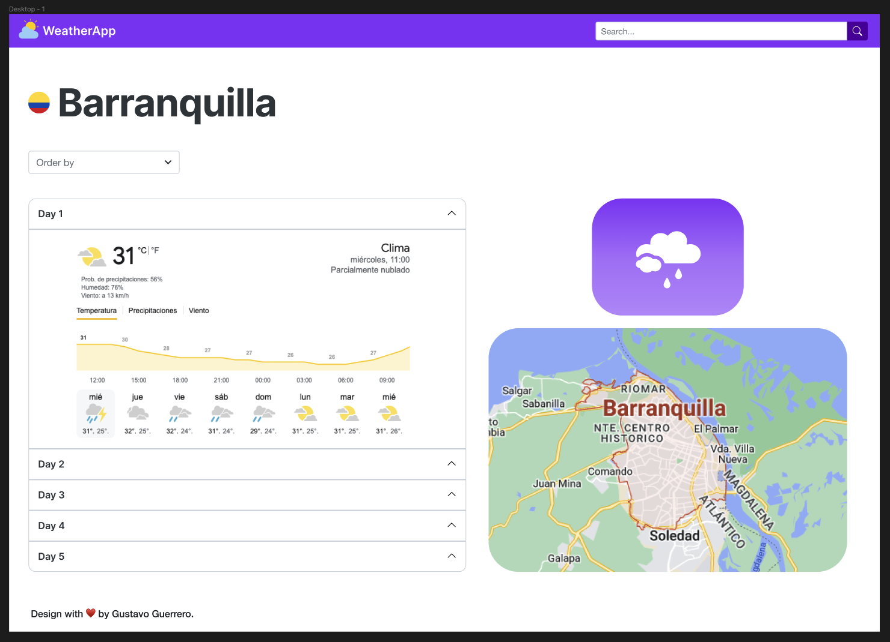

# WeatherApp

Este proyecto es una aplicacion web desarrollada en Angular (en su version 15.2.10 [Angular CLI](https://github.com/angular/angular-cli)) para la consulta del clima, usando la API de [openweathermap.org](https://openweathermap.org/)

Entre sus funcionalidad esta:

  - La aplicación debe permitir a los usuarios buscar una ubicación válida usando un nombre de ciudad y opcionalmente de un país.
  - Mostrar el clima actual y el clima esperado para los pŕoximos 5 días. ● Posibilidad de ordenar los resultados de los próximos 5 días por fecha DESC y ASC.

## Run Project

Para correr este proyecto:
  - se debe clonar el repositorio, haciendo git clone https://github.com/GustavoG18/weather-app
  - npm install
  - setear las variables de environment, en el environment.ts
    - API_WEATHER_KEY: key para hacer peticiones a la API de [openweathermap.org](https://openweathermap.org/)
    - API_KEY_MAP: key para usar la API places de google con la cual creamos un autocomplete para obtener los nombres de las ciudades y paises [google cloud console](https://console.cloud.google.com/)
  - npm start

## Test Project

Para correr las pruebas de este proyecto [Se realizaron usando el entorno de Karma con Jasmine, no se realizaron todos los test de los componentes debido a falta de tiempo, pero se realizaron algunos de los componentes mas importantes.]
  - npm test

## Design

Se diseño una maqueta de la interfaz de la aplicativo en figma.

## URL Deploy Application

Puede visitar la version de la aplicacion desplegada: [weather-app.com](https://weather-app-4da87.web.app/)
