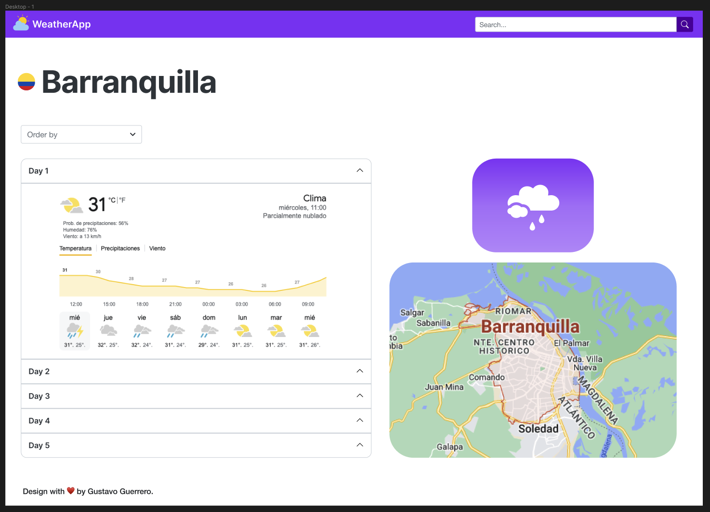

# WeatherApp

Este proyecto es una aplicacion web desarrollada en Angular (en su version 15.2.10 [Angular CLI](https://github.com/angular/angular-cli)) para la consulta del clima, usando la API de [openweathermap.org](https://openweathermap.org/)

Entre sus funcionalidad esta:

  - La aplicación debe permitir a los usuarios buscar una ubicación válida usando un nombre de ciudad y opcionalmente de un país.
  - Mostrar el clima actual y el clima esperado para los pŕoximos 5 días. ● Posibilidad de ordenar los resultados de los próximos 5 días por fecha DESC y ASC.

## Design

Se diseño una maqueta de la interfaz de la aplicativo en figma.

## Install package

### ts-standart
